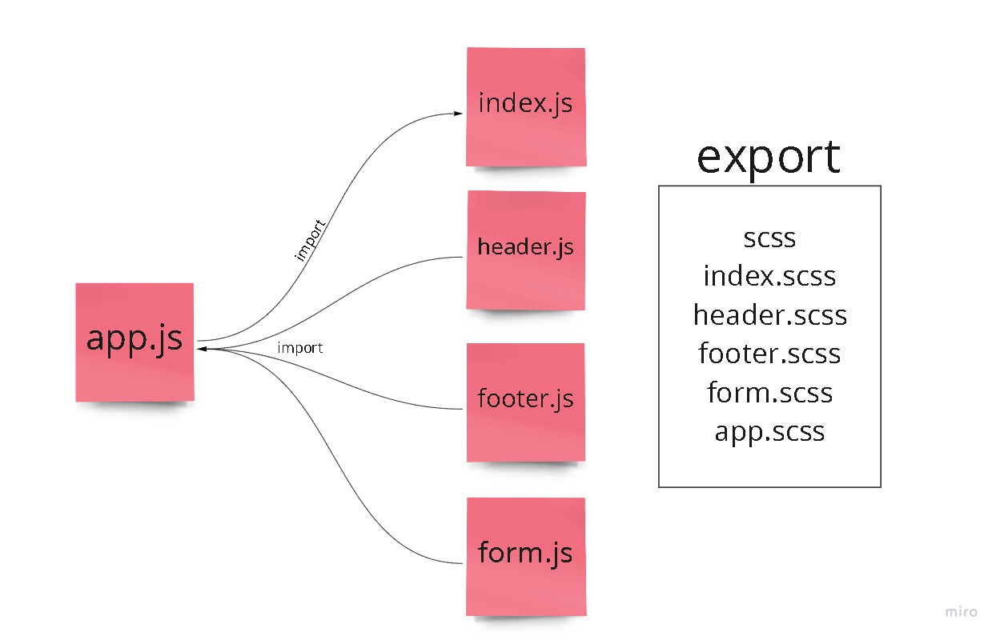

# Component Based UI

## Description
- Distinct the Header, Footer, and Counter components into separate files - Properly export them as defaults - Import them into the App Component using the ES6 import statement
- Button Handlers - It's much better if they can connect both buttons with a single handler.
- Begin by installing and running the program, noting its architecture as you go.All sub-components of this application are in the App component.Please you not change this component's status to Class.   
In order to create the site's foundation design, the program uses a.CSS file imported from a computer.Use the ES6 import syntax to import Header, Footer, Results, and Form components from other files,In addition, each of the components has its own.scss file is used to style If you're using a form, it should:
  This function is handed down through a prop to the App component so that it may begin the procedure.

## Links

## lab
https://codesandbox.io/s/uz2lx

https://github.com/dana-younis/resty/actions

## UML

